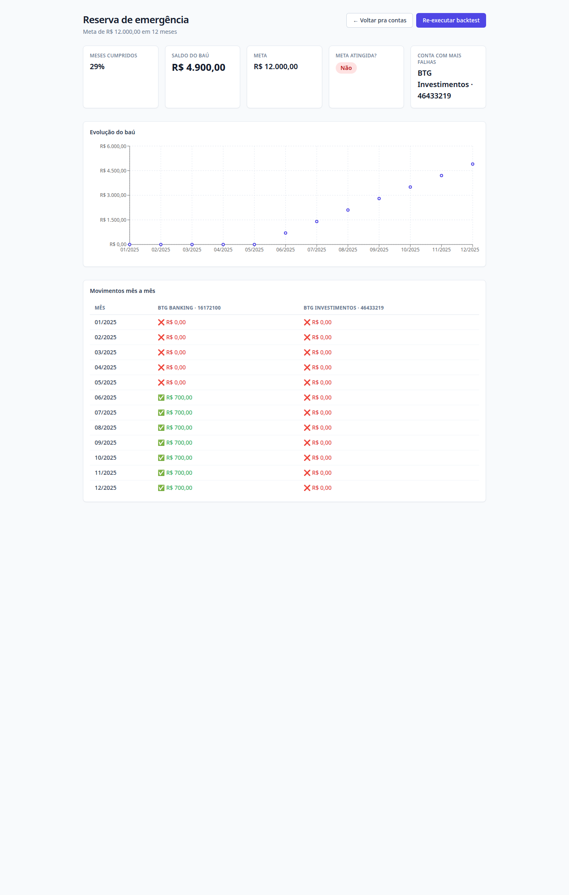
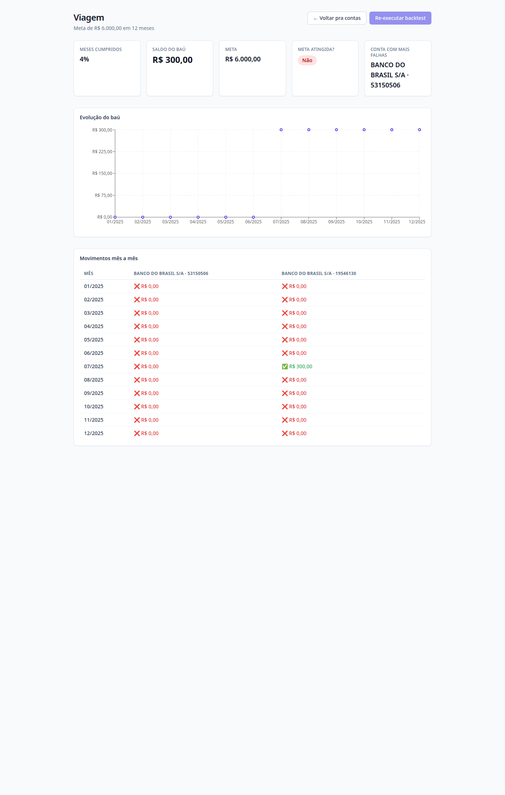
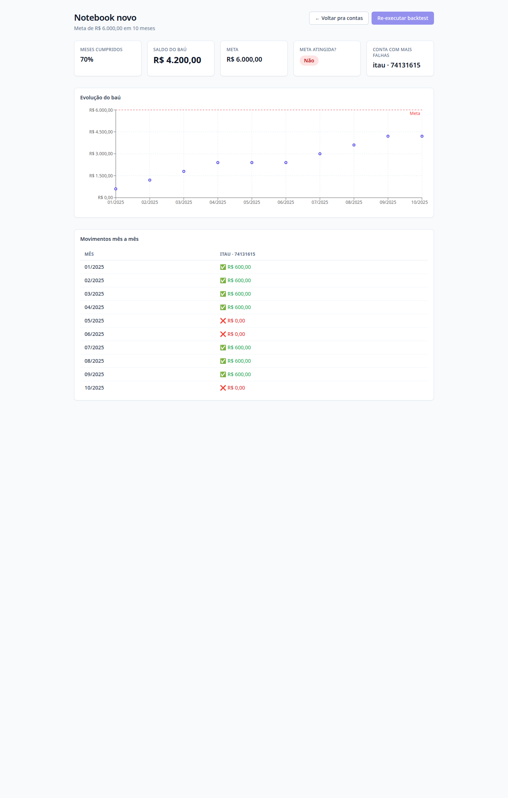
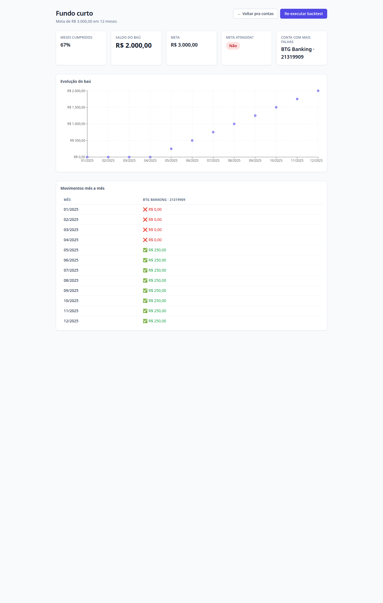
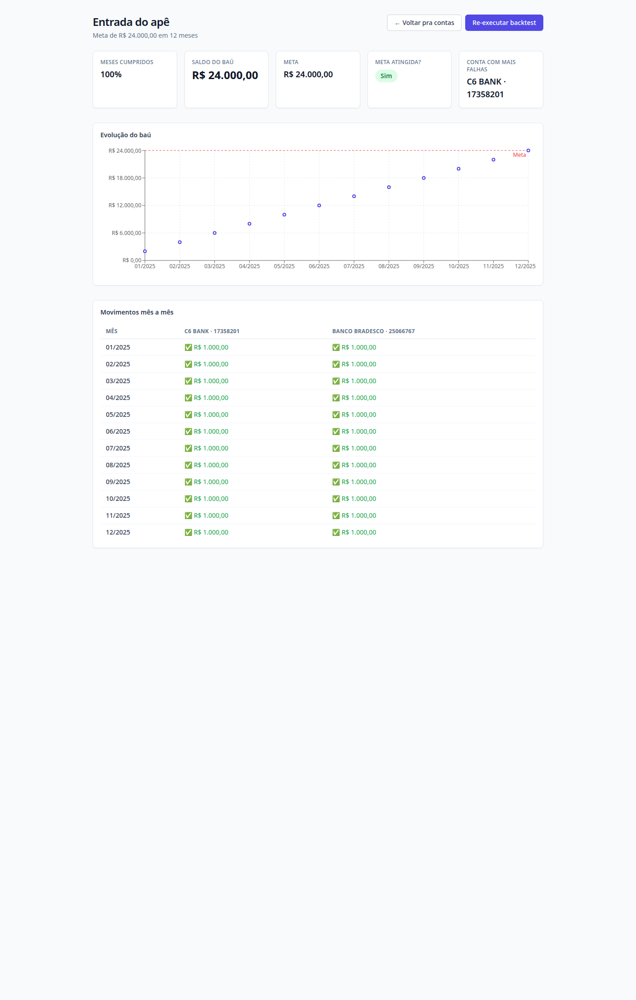

# Smoke E2E — Centralizador de Saldo (POC)

Validação do critério **§10** do [PRD](../PRD.md): rodar o fluxo completo
(seleção de cliente → criação do objetivo → backtest) com **5 clientes reais**
da massa, conferindo os números contra o banco.

- **`POC_REFERENCE_DATE` em uso:** `2025-01-01` (toda regra temporal usa essa data, não `NOW()`).
- **Data da execução do smoke:** 2026-05-28.
- **Backend:** `go run ./cmd/api` (`:8080`) · **Frontend:** Vite (`:5173`) · **DB:** Postgres 16 (docker).
- **Screenshots:** capturadas da tela de resultados (`/goals/<id>`) com Chrome headless. Ficam em [`smoke/screenshots/`](smoke/screenshots/).

## Como os clientes foram escolhidos

A massa só tem histórico a partir de ~ago/2024, então o filtro original de
"histórico > 6 meses antes da data de referência" (`< 2024-07-01`) não retorna
ninguém com 2+ contas. O critério foi relaxado para **múltiplas contas +
movimento expressivo**, priorizando variedade de cenários (meta atingida, meta
parcial, fundos escassos e cliente de grande porte). Query base:

```sql
SELECT ba.user_id, COUNT(DISTINCT ba.id) AS contas,
       COUNT(te.*) AS transacoes,
       MIN(te.transaction_date_time) AS primeira_tx,
       MAX(te.transaction_date_time) AS ultima_tx
FROM bank_accounts ba
LEFT JOIN transaction_events te ON te.account_id = ba.id
GROUP BY ba.user_id
HAVING COUNT(DISTINCT ba.id) >= 2
ORDER BY contas DESC, transacoes DESC;
```

---

## Cliente 1 — Reserva de emergência (multi-conta, parcial)

- **`user_id`:** `506aa9767e99d3c9e9f2ef6a2f0737baf1b7312fa82bcf9491f3c4d76d4e8b89`
- **Contas:** 3 · **Histórico:** 2024-09-16 → 2026-01-08
- **Objetivo:** "Reserva de emergência" · meta **R$ 12.000,00** em **12 meses** · saque dia **5**
  - BTG Banking `…16172100` → **70%** (R$ 700/mês)
  - BTG Investimentos `…46433219` → **30%** (R$ 300/mês)
- **Resultado:** **7/24** movimentos cumpridos (29%) · baú final **R$ 4.900,00** · **meta NÃO atingida**
- **Observação:** a conta BTG Banking só passa a ter saldo a partir de jun/2025 e
  daí cumpre todos os R$ 700; a conta de investimentos fica em saldo zero o tempo
  todo (conta com mais falhas). Mostra bem que a engine avalia cada conta
  isoladamente, sem uma cobrir a outra (RF-05).



---

## Cliente 2 — Viagem (fundos escassos, quase tudo falha)

- **`user_id`:** `a84f8062bdee87c03a5afa76cc06ecf07150c22f6e6163cc291ab9e39a4d79f0`
- **Contas:** 3 · **Histórico:** 2024-09-28 → 2026-01-08
- **Objetivo:** "Viagem" · meta **R$ 6.000,00** em **12 meses** · saque dia **5**
  - Banco do Brasil `…53150506` → **60%** (R$ 300/mês)
  - Banco do Brasil `…19546130` → **40%** (R$ 200/mês)
- **Resultado:** **1/24** cumprido (4%) · baú final **R$ 300,00** · **meta NÃO atingida**
- **Observação:** cliente sem saldo reconstruído relevante — praticamente todos os
  saques falham por saldo insuficiente. É o caso-limite "não dá pra centralizar
  o que não existe" e a UI deixa isso explícito (KPIs vermelhos).



---

## Cliente 3 — Notebook novo (conta única, maioria cumprida)

- **`user_id`:** `4696e5644145008947dc3543ae246a7ed68edfd45af2af1d8e76ed04de5b4907`
- **Contas:** 2 · **Histórico:** 2024-09-14 → 2026-01-06
- **Objetivo:** "Notebook novo" · meta **R$ 6.000,00** em **10 meses** · saque dia **10**
  - Itaú `…` (CONTA_DEPOSITO_A_VISTA) → **100%** (R$ 600/mês)
- **Resultado:** **7/10** cumpridos (70%) · baú final **R$ 4.200,00** · **meta NÃO atingida**
- **Observação:** prazo mais curto (10 meses) e dia de saque diferente (10) pra
  variar os parâmetros. A conta cumpre os R$ 600 na maior parte dos meses e
  falha apenas em mai, jun e out/2025 — onde o saldo efetivo (já descontados os
  saques anteriores do backtest) não cobre a parcela.



---

## Cliente 4 — Fundo curto (histórico recente)

- **`user_id`:** `02cb375e33fb23df58bbfc2258a0ce24afcb465c9b12bf2acddb5d27ec2f4541`
- **Contas:** 2 · **Histórico:** 2025-04-07 → 2026-01-12
- **Objetivo:** "Fundo curto" · meta **R$ 3.000,00** em **12 meses** · saque dia **5**
  - BTG Banking `…` (CONTA_DEPOSITO_A_VISTA) → **100%** (R$ 250/mês)
- **Resultado:** **8/12** cumpridos (67%) · baú final **R$ 2.000,00** · **meta NÃO atingida**
- **Observação:** primeiro evento da conta é abr/2025, então jan–mar falham
  (saldo zero antes do histórico começar) e a partir daí cumpre. Bom teste de
  como a reconstrução de saldo lida com conta "nova" relativa à data de início.



---

## Cliente 5 — Entrada do apê (cliente de grande porte, meta atingida)

- **`user_id`:** `695a8cddb2c3fcf4d0536663f8cfca8f4d147f14d1af5e4835c2aeb82b80ce84`
- **Contas:** 195 · **Histórico:** 2024-08-28 → 2026-05-08
- **Objetivo:** "Entrada do apê" · meta **R$ 24.000,00** em **12 meses** · saque dia **5**
  - C6 Bank `…17358201` → **50%** (R$ 1.000/mês)
  - Banco Bradesco `…25066767` → **50%** (R$ 1.000/mês)
- **Resultado:** **24/24** cumpridos (100%) · baú final **R$ 24.000,00** · **META ATINGIDA ✅**
- **Observação:** cliente com volume alto e contas bem providas o ano todo —
  cumpre 100% dos saques e bate a meta exatamente. Demonstra a centralização
  multi-conta funcionando no melhor cenário.



---

## Validação cruzada (§10 item 2)

Para cada objetivo, o `summary.vault_balance` devolvido pela API tem de bater com
`SUM(amount)` dos movimentos `COMPLETED` persistidos em `goal_vault_movements`:

```sql
SELECT g.name,
       SUM(m.amount) FILTER (WHERE m.status='COMPLETED') AS soma_completed_db
FROM goals g
JOIN goal_vaults v ON v.goal_id = g.id
JOIN goal_vault_movements m ON m.vault_id = v.id
GROUP BY g.name;
```

| Cliente | Objetivo              | `vault_balance` (API) | `SUM(COMPLETED)` (DB) | Cumpridos | Falhos | Bate? |
| ------- | --------------------- | --------------------: | --------------------: | --------: | -----: | :---: |
| 1       | Reserva de emergência |          R$ 4.900,00  |          R$ 4.900,00  |     7     |   17   |  ✅   |
| 2       | Viagem                |            R$ 300,00  |            R$ 300,00  |     1     |   23   |  ✅   |
| 3       | Notebook novo         |          R$ 4.200,00  |          R$ 4.200,00  |     7     |    3   |  ✅   |
| 4       | Fundo curto           |          R$ 2.000,00  |          R$ 2.000,00  |     8     |    4   |  ✅   |
| 5       | Entrada do apê        |         R$ 24.000,00  |         R$ 24.000,00  |    24     |    0   |  ✅   |

**5/5 batem exatamente.** O saldo do baú reportado é sempre a soma dos saques
efetivamente concluídos — nenhuma divergência.

---

## Recomendação

### ✅ GO

O fluxo ponta-a-ponta funciona com dados reais da massa nos 5 clientes:

1. **Correção comprovada:** a validação cruzada API × banco bateu nos 5 casos
   (§10 item 2). O `vault_balance` é exatamente a soma dos movimentos
   `COMPLETED`, e a contagem cumpridos/falhos confere.
2. **Comportamento esperado em todos os cenários:** meta atingida (cliente 5),
   parciais (1, 3, 4) e fundos escassos (2). A engine avalia cada conta
   isoladamente (RF-05) e a UI comunica o resultado com clareza.
3. **Robustez:** lida bem com conta de histórico recente (cliente 4), cliente de
   grande porte com 195 contas (cliente 5) e saldo insuficiente (cliente 2) sem
   erro nem travamento.

### Ressalvas (não bloqueiam a POC)

- **Saldo inicial = 0 (§6):** como a massa não traz saldo de abertura, a
  reconstrução parte do zero. Contas cujos créditos chegam mais tarde falham nos
  meses iniciais, e algumas chegam a ter saldo acumulado negativo (artefato dos
  dados, não bug da engine). Para um produto real seria preciso um saldo de
  abertura/snapshot por conta.
- **Janela de dados curta:** o histórico começa em ago/2024, contra uma
  `POC_REFERENCE_DATE` de 2025-01-01, o que limita backtests "para trás".

**Conclusão:** a hipótese central do produto — centralizar saques automáticos de
múltiplas contas num baú de objetivo — está validada de ponta a ponta para a
POC. Recomenda-se **seguir** (go), tratando as ressalvas acima na próxima fase.
